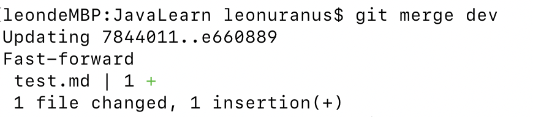
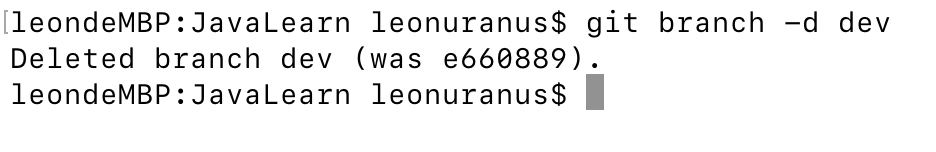
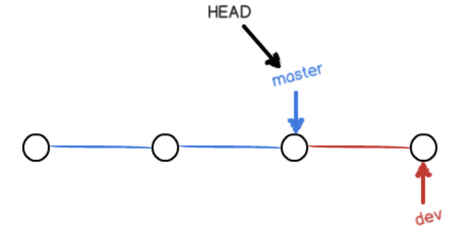
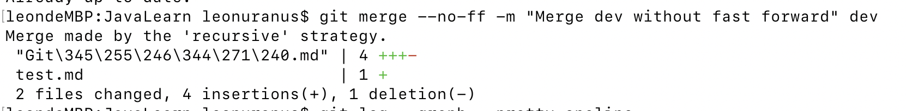
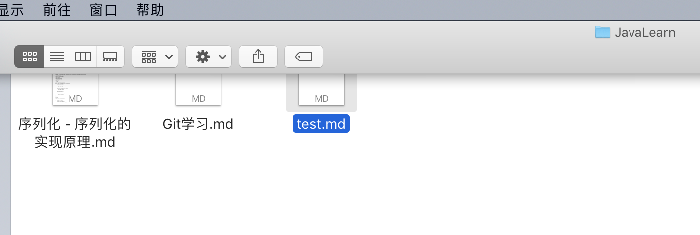
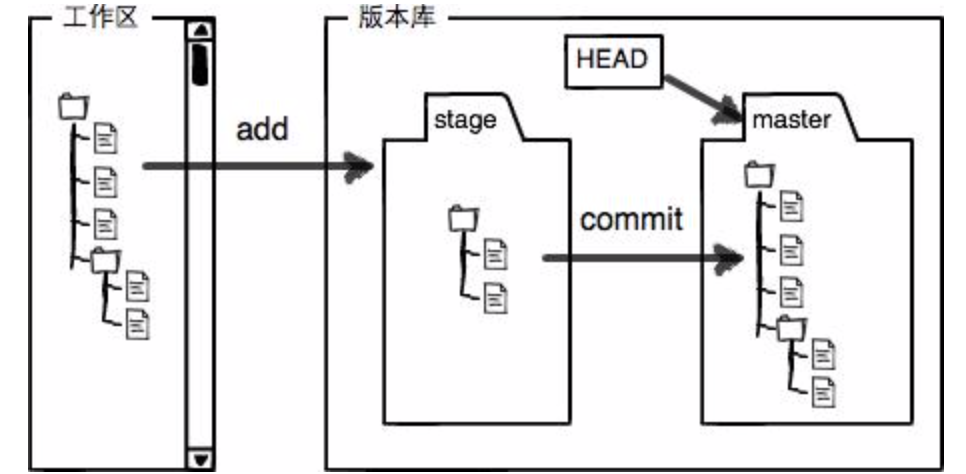
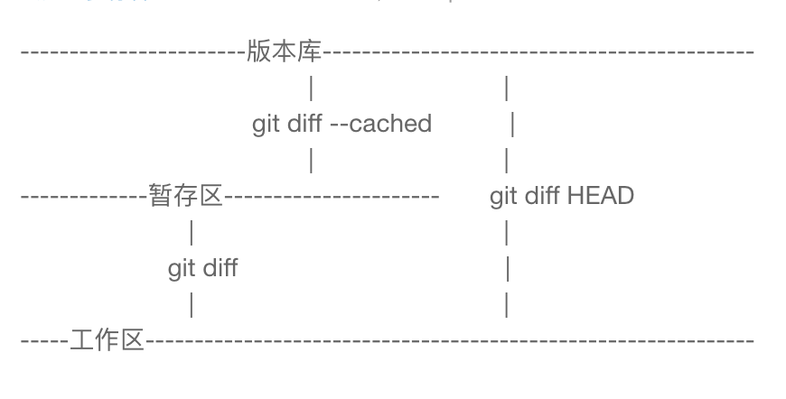
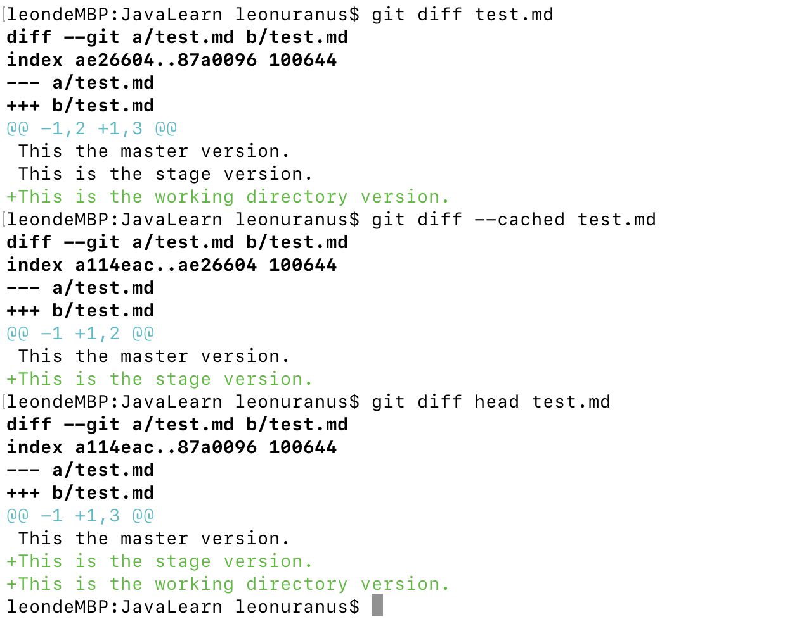

# Git学习

学习内容

- Git的基本使用
- Git的原理

## wiki

- [Git教程-廖雪峰](https://www.liaoxuefeng.com/wiki/0013739516305929606dd18361248578c67b8067c8c017b000)

## Git基本使用

- Git初始化：`git init`

- 添加文件到仓库

  - 使用命令`git add <file>`，注意，可反复多次使用，添加多个文件；

  - 使用命令`git commit -m <message>`，完成;

- 要随时掌握工作区的状态，使用`git status`命令。

- 如果`git status`告诉你有文件被修改过，用`git diff`可以查看修改内容。

- `HEAD`指向的版本就是当前版本，因此，Git允许我们在版本的历史之间穿梭，使用命令`git reset --hard commit_id`。

- 穿梭前，用`git log`可以查看提交历史，以便确定要回退到哪个版本。

- 要重返未来，用`git reflog`查看命令历史，以便确定要回到未来的哪个版本。

- 撤销修改
  - 场景1：当你改乱了工作区某个文件的内容，想直接丢弃工作区的修改时，用命令`git checkout -- file`。
  - 场景2：当你不但改乱了工作区某个文件的内容，还添加到了暂存区时，想丢弃修改，分两步，第一步用命令`git reset HEAD <file>`，就回到了场景1，第二步按场景1操作。
  - 场景3：已经提交了不合适的修改到版本库时，想要撤销本次提交，使用`git reset --hard commit_id`，不过前提是没有推送到远程库。

- 远程分支

  - 要关联一个远程库，使用命令`git remote add origin git@server-name:path/repo-name.git`；

  - 关联后，使用命令`git push -u origin master`第一次推送master分支的所有内容；

  - 此后，每次本地提交后，只要有必要，就可以使用命令`git push origin master`推送最新修改；

- 分支

  - 查看分支：`git branch`，命令会列出所有分支，当前分支前面会标一个`*`号。

  - 创建分支：`git branch <name>`

  - 切换分支：`git checkout <name>`

  - 创建并切换分支：`git checkout -b <name>`

  - ```shell
    $ git checkout -b dev
    Switched to a new branch 'dev'
    ```

    `git checkout`命令加上`-b`参数表示创建并切换，相当于以下两条命令：

    ```shell
    $ git branch dev
    $ git checkout dev
    Switched to branch 'dev'
    ```

  - 合并某个分支到当前分支:`git merge <name>`用于合并分支

    

  - 删除分支：`git branch -d <name>`用于删除分支

    

  - 分支原理

    

    在合并分支时，默认使用`fast forward`模式，在删除分支后，分支的信息不会保存。

    使用命令`git merge --no-ff`命令合并分支时，会生成一个新的commit。

    

    

  - stash：将当前工作现场存储起来

    - [储藏 stash](https://git-scm.com/book/zh/v1/Git-%E5%B7%A5%E5%85%B7-%E5%82%A8%E8%97%8F%EF%BC%88Stashing%EF%BC%89)

    - 存储工作现场：`git stash`

      

    - 查看现有的存储：`git stash list`

      

    - 恢复存储

      - 一是用`git stash apply`恢复，但是恢复后，stash内容并不删除，你需要用`git stash drop`来删除；
      - 另一种方式是用`git stash pop`，恢复的同时把stash内容也删了。

  - 远程分支

    - 查看远程库信息，使用`git remote -v`；
    - 本地新建的分支如果不推送到远程，对其他人就是不可见的；
    - 从本地推送分支，使用`git push origin branch-name`，如果推送失败，先用`git pull`抓取远程的新提交；
    - 在本地创建和远程分支对应的分支，使用`git checkout -b branch-name origin/branch-name`，本地和远程分支的名称最好一致；
    - 建立本地分支和远程分支的关联，使用`git branch --set-upstream branch-name origin/branch-name`；
    - 从远程抓取分支，使用`git pull`，如果有冲突，要先处理冲突。

## Git原理

### 基本概念

- 工作区(Working Directory)

  本地可以看到的目录，以目前学习的目录为例，下图的目录就是工作区。

  

- 版本库(Repository)

  工作区有一个隐藏目录`.git`，这个不算工作区，而是Git的版本库。

  Git的版本库里存了很多东西，其中最重要的就是称为stage（或者叫index）的暂存区，还有Git为我们自动创建的第一个分支`master`，以及指向`master`的一个指针叫`HEAD`。

  

  第一步使用`git add`的添加文件，是将文件从工作区添加到暂存区；

  第二部使用`git commit`提交更改，是将暂存区的文件提交当前分支；

  > `git diff`,`git diff --cached`和`git diff head`的区别
  >
  > - git diff 是工作区和暂存区区比较
  > - git diff --cached是暂存区区和仓库比较。
  > - git diff head是工作区和仓库比较
  >
  > 
  >
  > 实验：对于test.md，有工作区版本，暂存区版本和仓库区版本。
  >
  > 1. 经过add, commit，此时三个版本相同
  > 2. 修改再add，工作区版本和暂存区版本相同，仓库区版本则不同；
  > 3. 再修改，不执行add，则三个版本都不相同。
  >
  > 仓库版本
  >
  > ```java
  > This the master version.
  > ```
  >
  > 暂存区版本；
  >
  > ```java
  > This the master version.
  > This is the stage version.
  > ```
  >
  > 工作区版本
  >
  > ```java
  > This the master version.
  > This is the stage version.
  > This is the working directory version.
  > ```
  >
  > 执行第3步后，三个版本都不相同
  >
  > 使用`git diff`和`git diff --cached`和`git diff head`，可以看到
  >
  > - `git diff`是工作区版本和暂存区版本比较；
  > - `git diff --cached`时暂存区版本和仓库版本比较。
  > - `git diff head`是工作区和仓库区比较；
  >
  > 


