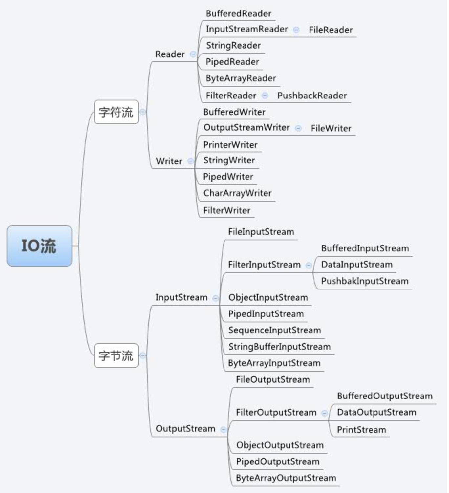
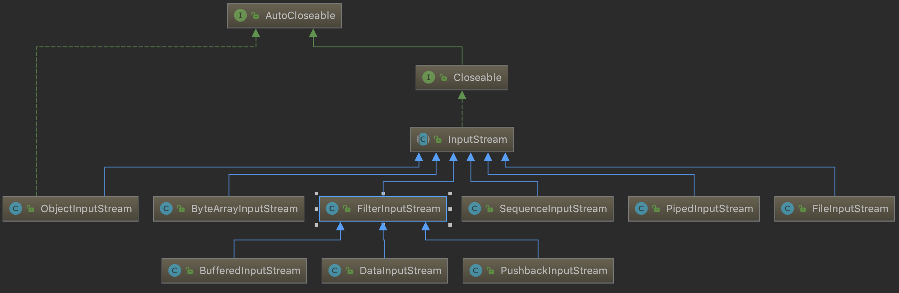
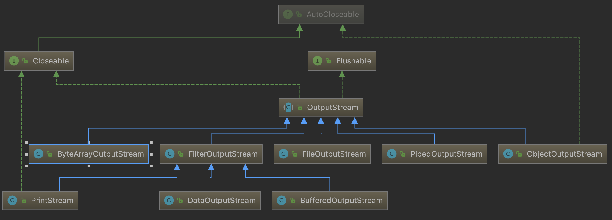

# Java IO

## wiki

- [Java 的 I/O 类库的基本架构](https://www.ibm.com/developerworks/cn/java/j-lo-javaio/index.html)
- [核心java系列——I/O流详解(一)](https://www.kancloud.cn/digest/core-java/140255)

## IO要点

- Java IO使用装饰者模式实现；

- 整体类的结构 

  

## InputStream

首先查看InputStream相关类的整体结构，InputStream是所有字节输入流类的抽象父类。

字节输入流相关类是使用装饰者模式实现，其中`FilterInputStream`时装饰者模式中的抽象装饰者类，InputStream的其他类是被装饰类。



---

## OutputStream

- 打开文件
- 向文件输出内容



### FileInputStream

```java
public static void main(String[] args)
{
    String fileName = "/Users/leonuranus/learn/JavaLearn/test1.md";
    OutputStream op = null;
    try
    {
        String content = "test";
        op = new FileOutputStream(new File(fileName),true);
        byte[] b = content.getBytes();
        op.write(b);
    }
    catch(FileNotFoundException e)
    {
        Log.debug("File not found.");
        e.printStackTrace();
    }
    catch (IOException e)
    {
        e.printStackTrace();
    }
    finally
    {
        // 关闭输出流
        try {
            if (op != null) {
                op.close();
            }
        }
        catch (IOException e)
        {
            e.printStackTrace();
        }
    }
}
```

- FileInputStream的作用是在文件中写入字节，写入模式有两种

  - 从文件开头写入；
  - 从文件结尾写入。

- 初始化方法共5个，可以传入File类型的参数，也可以直接将路径传入，参数`append = true`表示从文件结尾写入。

  - `public FileOutputStream(File file) throws FileNotFoundException{}` —传入File类型参数，默认从文件开头写入
  - `public FileOutputStream(File file, boolean append) throws FileNotFoundException{}`
  - `public FileOutputStream(String name) throws FileNotFoundException{}` —直接将路径传入

  - `public FileOutputStream(String name, boolean append) throws FileNotFoundException{}` 
  - `public FileOutputStream(FileDescriptor fdObj){}` —传入已经打开的文件对应的文件描述符

### BufferedOutputStream

#### 实现原理

BufferedOutputStream的作用是为其他输出流提供缓存机制。

BufferedOutputStream的构造方法有两个，最主要的是`public BufferedOutputStream(OutputStream out, int size)`;

- 如果只传入`OutputStream`，则初始化缓存数组长度为8192；
- 初始化时可以传入缓存数组长度。

```java
public BufferedOutputStream(OutputStream out) {
    this(out, 8192);
}
```

```java
public BufferedOutputStream(OutputStream out, int size) {
    super(out);
    if (size <= 0) {
        throw new IllegalArgumentException("Buffer size <= 0");
    }
    buf = new byte[size];
}
```

接下来查看BufferedOutputStream的`write`方法，从而查看缓存的意义所在。

- 如果输入的字节长度大于缓存，则将缓存内容输出，并且直接将字节数组直接输出；
- 如果输入字节长度大于剩余缓存长度，将缓存内容输出，然后将字节数组加入缓存。

```java
public synchronized void write(byte b[], int off, int len) throws IOException {
    if (len >= buf.length) {
        /* If the request length exceeds the size of the output buffer,
           flush the output buffer and then write the data directly.
           In this way buffered streams will cascade harmlessly. */
        flushBuffer();
        out.write(b, off, len);
        return;
    }
    if (len > buf.length - count) {
        flushBuffer();
    }
    System.arraycopy(b, off, buf, count, len);
    count += len;
}
```

如果不需要缓存，则可以调用`BufferedOutputStream.flush()`将缓存内容输出。

```java
/**
 * Flushes this buffered output stream. This forces any buffered
 * output bytes to be written out to the underlying output stream.
 *
 * @exception  IOException  if an I/O error occurs.
 * @see        java.io.FilterOutputStream#out
 */
public synchronized void flush() throws IOException {
    flushBuffer();
    out.flush();
}
```

#### 基本用法

```java
public static void main(String[] args)
{
    String fileName = "/Users/leonuranus/learn/JavaLearn/test1.md";
    OutputStream op = null;
    try
    {
        op = new BufferedOutputStream(new FileOutputStream(fileName,false), 16);
        op.write(ArrayLetters, 0,12);
    }
    catch(FileNotFoundException e)
    {
        Log.debug("File not found.");
        e.printStackTrace();
    }
    catch (IOException e)
    {
        e.printStackTrace();
    }
    finally
    {
        try {
            if (op != null) {
                op.close();
            }
        }
        catch (IOException e)
        {
            e.printStackTrace();
        }
    }
}
```