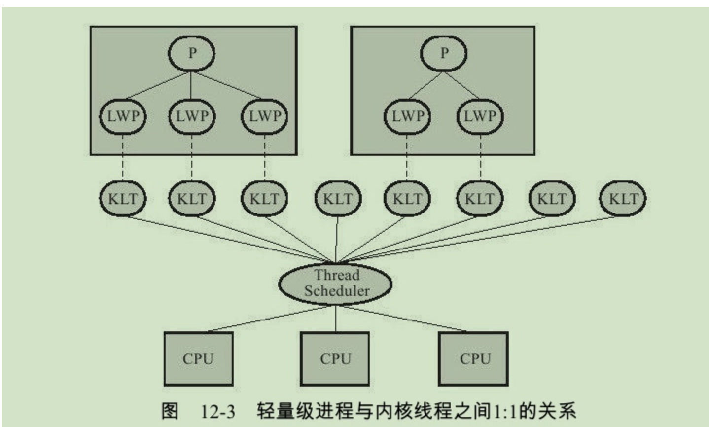
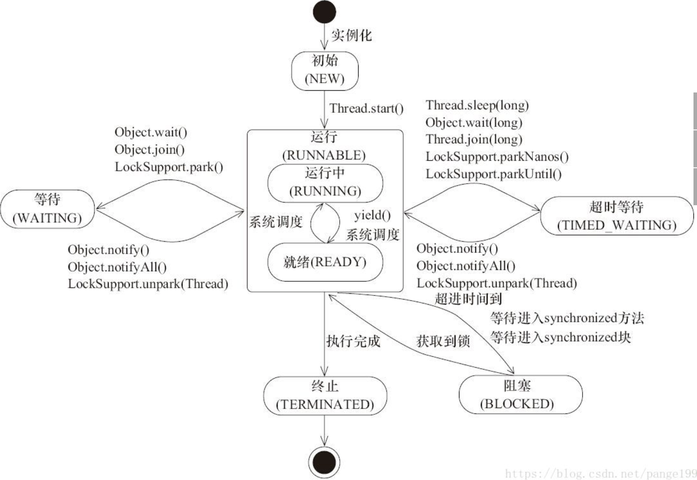

# 并发

##  Java中的线程

### 实现线程的方式

实现线程的方式主要有三种

1. 使用内核线程实现；
2. 使用用户线程实现；
3. 使用用户线程加轻量级进程混合实现。

#### 使用内核线程实现



- 内核线程（Kernel-Level Thread, KLT）：直接由操作系统内核（Kernel）支持的线程。
- 内核线程由内核完成线程切换，内核通过操作调度器（Scheduler）对线程进行调度，并负责将线程的任务映射到各个处理器上。

### 线程状态



Java线程状态可以分为6种

1. 初始（New）：新创建一个线程对象，但是没有调用`start()`方法；
2. 运行（RUNNABLE）:分为就绪（READY）和运行中（RUNNING）两种状态
   1. 就绪（READY）：线程对象创建后，其他线程调用了该对象的`start()`方法。该状态的线程位于可运行线程池中，等待被线程调度选中并分配**cpu使用权**。
   2. 运行中（RUNNING）：就绪状态的线程获得了cpu时间片，开始执行程序代码。
3. 阻塞（BLOCKED）：表示线程阻塞于锁。
4. 等待（WAITING）：进入该状态的线程需要等待其他线程作出一些特定动作；
5. 超时等待（TIME_WAITING）：该状态不同于WAITING, 可以在指定时间后自行返回；
6. 终止(TERMINATED):表示该线程已经执行完毕。

### 线程调度

线程只有获取了CPU时间片，状态才可以由就绪变为运行中时，而**给多个线程按照特定机制分配CPU的使用权的过程就是线程调度**。

- Linux线程调度

  - SCHED_OTHER 分时调度策略，（默认的）
  - SCHED_FIFO 实时调度策略，先到先服务
  - SCHED_RR 实时调度策略，时间片轮转
- Window线程调度：基于优先级的，抢占调度算法来调度线程。
- Java虚拟机采用抢占式调度模型。

---

# 极客时间学习笔记

## 可见性，原子性，有序性

- 可见性：因为CPU和IO之间速度的差异，计算机系统为CPU添加了缓存，不同CPU都有自己的缓存；线程A在缓存A中处理了变量var，但是没有将处理后的变量存入到内存中，其他线程无法获取变化后的var。
- 原子性：线程切换实在CPU指令执行完成后切换，而高级语言中一句代码可能对应多行CPU指令。
- 有序性：对指令进行重排序

```java
public class Singleton {
  static Singleton instance;
  static Singleton getInstance(){
    if (instance == null) {
      synchronized(Singleton.class) {
        if (instance == null)
          instance = new Singleton();
        }
    }
    return instance;
  }
}
```

### 原子性的解决方法

- 原子性的定义：一个或者多个操作在CPU执行过程中不被中断的特性，被称为“原子性”；
  - 问题源头：线程的切换
  - 因此需要保证**同一个时刻只有一个线程执行**这个条件，此条件被称为**互斥**；
  - 