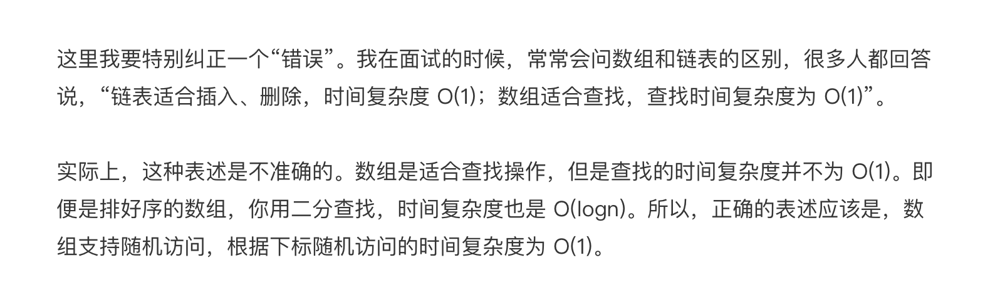

# 基础篇

## 数组

数组(Array)是一种**线性表**数据结构，用一组**连续的内存空间**，存储一组具有**相同类型**的数据。

特点是支持**随机存储**，但是插入，删除操作效率比较低，平均时间复杂度是`O(n)`。

- 线性表：线性表结构有数组，链表，队列和栈等数据结构，数据之间具有前后关系；
- 非线性表：二叉树，堆，图等，数据之间不是简单的前后关系。

- **连续的内存空间和相同类型的数据**：优点是随机访问，缺点是删除和插入效率低。

> 

- 为什么数组编号从0开始编号

  > 因为数组具有随机访问特性，而随机访问需要获取`a[k]`的地址，而获取地址的公式是
  >
  > `a[k]_address = base_address + k * type_size`
  >
  > 如果从1开始，上述的公式需要变为`a[k]_address = base_address + (k - 1) * type_size`，需要多进行一次减法运算。
  >
  > 因此编号从0开始可以提高效率。

---

## 链表

### 正确书写链表

